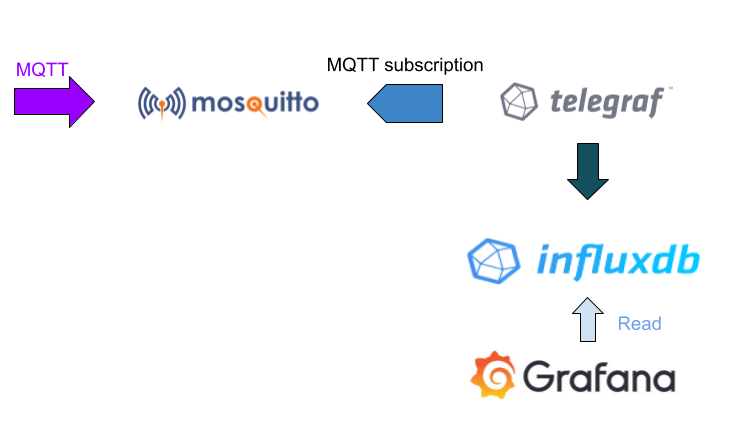
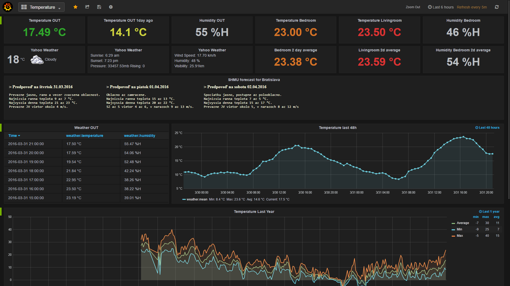

# IoT platform (full stack, containerised, open source)

Leveraging the famous opensource products **Mosquitto**, **InfluxDB**, **Telegraf**, **Grafana** and **NodeRed**, this project aims to be the building block of an IoT platform useful to:

- collect data from environmental sensors via MQTT protocol (Mosquitto)
- store sensor measurements in a time series database (InfluxDB + Telgraf)
- create beautiful graphs and histograms to display the collected data (Grafana)
- trigger actions with custom logic when a data event occures (NodeRed)

Whether running on Cloud or using a RaspberryPi, everything has been  packaged in **Docker** containers to streamline deployment. 

Follow the setup guide [here](docker/README.md)